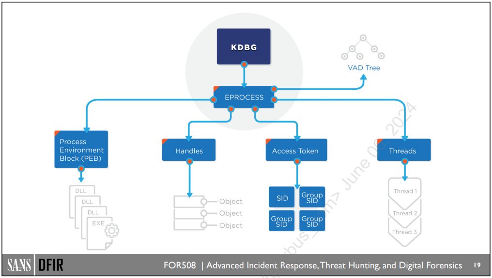

//# FOR500
//# FOR508
## Malware Persistence
### AutoStart locations
- NTUSER.DAT\Software\Microsoft\Windows\CurrentVersion\Run
- NTUSER.DAT\Software\Microsoft\Windows\CurrentVersion\RunOnce
- SOFTWARE\Microsoft\Windows\CurrentVersion\policies\Explorer\Run
- SOFTWARE\Microsoft\Windows\CurrentVersion\RunOnce
- SOFTWARE\Microsoft\Windows\CurrentVersion\Run
- SOFTWARE\Microsoft\Windows NT\CurrentVersion\Winlogon\Userinit
- %AppData%\Roaming\Microsoft\Windows\Start Menu\Programs\Startup
- SOFTWARE\WOW6432Node\Microsoft\Windows\CurrentVersion\Run
- SOFTWARE\WOW6432Node\Microsoft\Windows\CurrentVersion\RunOnce
- SYSTEM\\<CurrentControlSet\>\Services - (if Start == 0x02 -> start at boot)
### Service Creation/Replacement
#### HKML\SYSTEM\CurrentControlSet\Services
- Start with 0x02 : Automatic
- Start with 0x00 : Boot start of a device driver
#### Links
- [Mandiant APT1](https://for508.com/28vic/)
- [Peering into GlassRAT](https://for508.com/wc1u-/)
- [Stealthy Malware Persistence](https://for508.com/ojzea/)
### Scheduled Tasks
- C:\Windows\Tasks
- C:\Windows\System32\Tasks
- C:\Windows\Schedlgu.txt - XP only
- If TaskScheduler & a process have the same PPID => process has been launched by the taskscheduler
### DLL Hijacking
#### Links
- [Malware Persistence without the Windows Registry](https://for508.com/v2su7/)
- [DLL Search order](https://for508.com/9j5np/)
- [Phantom DLL](https://for508.com/m4frx/)
- [What The Fxsst](https://for508.com/sgeyk/)
- [DLL Side-Loader](https://for508.com/z8ni0/)
- [NetTraveler](https://for508.com/78nj2/)
- [DLL rules in AppLocker](https://for508.com/lkpf9/)
#### Hunting
- File System analyse: search .dll/.exe in unusual path
- Memory analyse: search DLL loaded from wrong location
- [Hunting with Velociraptor](https://for508.com/tsgpy/)
### WMI Event Consumers
#### Info
- Event Filter + Event Consumer + Binding => WMI
- PowerShell/mofcomp.exe to setup
#### Hunting
##### SysInternal Autorun
##### Kansa PowerShell framework
##### PowerShell cmdlet Get-WmiObject
- Get-WMIObject -Namespace rootSubscription -Class __EventFilter
- Get-WMIObject -Namespace rootSubscription -Class __EventConsumer
- Get-WMIObject -Namespace rootSubscription -Class __FilterToConsumerBinding
#### Links
- [Monitoring Events](https://for508.com/2jh-f/)
- [Stuxnet Under Microscope](https://for508.com/lj9em/)
- [There's nothing About WMI](https://for508.com/kc36x/)
- [Kansa & WMI Event Consumer](https://for508.com/c36i8/)
- [ELK Stack](https://for508.com/q1r94/)
### More Advanced
- Local GPO
- MS Office Add-In
- BIOS flashing

## Credential theft
### Compromission tools
- Incognito
- MetaSploit
- Powershell
- Mimikatz
- fgdump
- gsecdump
- AceHash
- PWDumpX
- creddump
- WCE
- Cachedump
- Cain
- Kerberoasting
- ntdsutil
- VSSAdmin
- NTDSXtract
- secretsdump.py
- Bloodhound + Empire with Death Star
- GoFetch
### Hunting
#### EventLog 4624
| Admin action | Logon Type | Creds on target? | Notes |
|-|-|-|-|
| Console logon | 2 | Yes* | * Except when Credential Guard is enabled |
| Run as | 2 | Yes* | * Except when Credential Guard is enabled |
| Remote desktop | 10 | Yes* | * Except when Credential Guard is enabled |
| Net Use | 3 | No |Including /u: parameter|
| Powershell Remoting | 3 | No |Invoke-Command or Enter-PSSession|
| PsExec alternate creds | 3 + 2 | Yes | -u <username> -p <password>|
| PsExec w/o explicit creds | 3 | No | |
| Remote Scheduled Task | 4 | Yes | Password saved as LSA Secret|
| Runas service | 5 | Yes | (w/user account) - Password saved as LSA Secret |
| Remote registry | 3 | No | |
#### HKLM\SYSTEM\CurrentControlSet\Control\SecurityProviders\WDigest with "UseLogonCredential" set to 1
### Info
#### Hashes
##### Defending
###### Stop remote interactive session with highly priviledged accounts
###### Ensure local admin account passwords are unique & not shared
###### Proper termination of RDP sessions
- Win8+:  force use of Restricted Admin
- Win10+: deploy Remote Credential Guard
###### Upgrade to Win10+
- Credential Guard
- WDigest & TsPkg creds no longer stored by default
- Domain protected users (mitiagte Pass The Hash attacks)
##### Links
- [Microsoft Security Advisory Update to Improve credentials Protection](https://for508.com/q1v9h)
- [Technet credentials protection & Mgmt](https://for508.com/306oh/)
- [Blocking remote use of local accounts](https://for508.com/zve0b)
- [Local Administrator Password solution](https://for508.com/mbrx6)
#### Token
##### Hunting / Defending
- Investigate users with SeImpersonate privilege
- Apply same defending actions as hashes password
- Use "Restricted Admin
- Use "Protected Users" security group
##### Links
- [Safeguarding Access Tokens](http://for508.com/zmyn0)
- [Security implications of Windows Acess Token](http://for508.com/6zblt)
- [Monitoring delegation Token](http://for508.com/4nv9m)
- [Safeguarding Access Tokens](http://for508.com/6c0n3)
- [Technet credentials protection & mgmt](http://for508.com/k69i3)
- ["Account is sensitive & cannot be delegated"](http://for508.com/khltc)
- [Technet Protected Users Security Group](http://for508.com/hm6po)
#### Cached credentials
##### Info
- Cannot be used for Pass-The-Hash attack
- Cached credentials much be cracked
- Hashes are case-sensitive & salted
- Service accounts & computer accounts are also cached
##### Hunting/Defending
- SECURITY\Cache key
- \SOFTWARE\Microsoft\Windows NT\CurrentVersion\Winlogon CachedLogonsCount set to 4 (10 => 25 by default)
- Use of Protected Users security groups
- Enforce password length
##### Links
- [Cached logons & CachedLogonsCount](http://for508.com/q09hg)
- [Domain Controller Security Technical Implementation Guide](http://for508.com/lwutc)
#### LSA secrets
##### Info
- Stored in the registry to allow services or tasks to be run with user privileges
- Can store application password like VPN or auto-logon creds
- The password is stored (not a hash)
##### Hunting/Defending
- SECURITY\Policy\Secrets
- SECURITY\Policy
- Do not employ services/schedule tasks requiring privileged accounts
- Reduce number of services requiring domain accounts
- Use (Group) Managed Service Accounts
##### Links
- [Avoid password mgmt with group managed services accounts](http://for508.com/80156)
#### Tickets
##### Info
- Tickets are generated by Kerberos
- Tickets are chached in memory and are valid for 10 hours
- Can be used as Pass the Ticket
- DCs can provide ticket with no expiration (Golden ticket)
##### Kerberos Attacks detail / mitigation
| Attack Name | Detail | Mitigation |
|-|-|-|
| Pass the ticket | Steal ticket from memory and pass or import on other systems | Credential Guard; Remote Credential Guard |
| Overpass the Hash | Use NT hash to request a service ticket for the same account | Credential Guard; Protected Users Group; Disable RC4 authentication |
| Kerberoasting | Request service ticket for highly privileged service & crack NT hash | Long & complex service account passwords; Managed service account |
| Golden Ticket | Kerberos TGT for any account with no expiration. Survives full password reset | Protect domain admin accounts; change KRBTGT password regularly | 
| Silver Ticket | All-access pass for a single service or computer | Regular computer account password update |
| Skeleton Key | Patch LSASS on domain controller to add backdoor password that works for any domain account| Protect domain admin accounts; smart card usage for privileged account |
| DCSync | Use fake Domain Controller replication to retrieve hashes (and hash history) for any account without login to the DC | Protect domain admin; audit/limit accounts with replication rights |
##### Defending
- Change KRBTGT password regularly
- Audit service accounts for unusual activity
- Credential Guard
- Remote Credential Guard
- Long & complex passwords on service accounts
##### Links
- [Protecting Windows Networkds - Kerberos Attacks](http://for508.com/l-zh8)
- [Protection from Kerberos Golden ticket](http://for508.com/i3-4q)
- [Exploring the limitations of Remote Credential Guard](http://for508.com/90fi6)
- [Github Kerberoast](http://for508.com/5acrs)
- [Kerberos in the Crosshairs: Golden tickets, Silver iickets, MITM and more](htt://for508.com/2d0ho)
#### NTDS.DIT
##### Info
- Stored in %SystemRoot%\NTDS
- Location can be modified in HKLM\SYSTEM\CurrentControlSet\Services\NTDS\Parameters
##### Links
- [GitHub - Bloodhound](http://for508.com/hfi9o)
- [Automating the Empire with Death Star](http://for508.Com/2riwf)
-[GitHub - GoFetch](http://for508.com/xdt0p)

## Program Execution
#### Prefetch
##### Info
- The original purpose is to improve system performence
- FileName like : <APPNAME>-<PATH_HASH>.pf
- Created after first execution of the app
- Logs all files and directories referenced by app
- Logs original path of execution
- Logs the total #of time app has been launched
- Logs the last time of execution
- From 128 files (win7 & before) to 1024 files (Win10 - Win11)
- Logs dates with ~10 seconds of delay

##### Hunting
###### Files in c:\Windows\Prefetch
###### HKLM\SYSTEM\CurrentControlSet\Control\Session Manager\Memory Management\PrefetchParameters - EnablePrefetcher key
###### HKLM\SYSTEM\CurrentControlSet\Services\SysMain - Start key
##### Tool
- Zimmerman's tool: PECmd.exe
##### Links
- [Prefetch Hash Calculator](http://for508.com/rlhjb)
- [Disabling Prefetch](http://for508.com/dv689)
- [Wht's new in Windows Application Execution](http://for508.com/wu15h)
#### ShimCache
##### Info
- Original purpose: identify if an app needs to be shimmed for retro-compatibility
- Tracks Last modification date & file path of the executable file
- Good for proving application was moved, renamed or timestamped
- Most recent events are on top (last OS versions do not record execute time)
- New entries are only written on shutdown (or reboot)
- / ! \ Since Vista, the InsertFlag does not guarantee the application was executed
- May be helpful to provide clue of existence of the tool if an attacker removed it & the prefetch file
##### Hunting
- SYSTEM\CurrentControlSet\Control\SessionManager\AppCompatCache\AppCompatCache (Win7+) - 1024 entries, InsertFlag gives some indication of execution but it is not definitive
- SYSTEM\CurrentControlSet\Control\SessionManager\AppCompatibility\AppCompatCache (WinXP-) - 96 entries, (2003 - up to 512)
##### Links
- [Secrets of the Aplication Compatibility Database](http://for508.com/g2msb)
- [Understanding Shims](http://for508.com/cyh3t)
- [Leveraging the application compatibility Cache in forensic investigation](http://for508.com/7pnmg)
##### Tools
- [Zimmerman's AppCompatCacheParser](http://for508.com/tk6mb)
- [Mandiant's ShimCacheParser](http://for508.com/ll4xr) 
#### AmCache
##### Info
- Win7+ only
- Tracks installed applications, programs executed, drivers loaded & more
- Provides full path, file size, SHA1 hash, publisher metada & some timestamps of app & driver
- Hash available for app <= 31.4Mo (due to performance), but quite enougth for investigation purpose
- Entries can be due to automated file discovery or program installation.
=> does not always indicate a program execution
##### Hunting
- C:\Windows\AppCompat\Programs\Amcache.hve
- Can be used as an indication of executable & driver presence on the system
- "InventoryApplicationFile" provides some information on the application
We then can use the "ProgramId" to pivot to "InventoryApplication" to get more info
- "InventoryDriverBinary" provides info in drivers on the system
we can look for anomalies hashes, signature, metadata or modification time (matching suspicious activity timeframe)
##### Tools
- [Zimmerman's AmcacheParser](https://github.com/EricZimmerman/AmcacheParser)
- [appcompatprocessor.py](http://for508.com/7k3oi)
- [ShimCache & Amcache enterprise-wide hunting](http://for508.com/hg6uy)
##### Links

## Lateral Movement
### RDP - VNC - TeamViewer
#### Source Artifacts
##### EventLogs
- Security.evtx: 4648
- Microsoft-Windows-TerminalServices-RDPClient%4Operational.evtx: 1024 & 1102
##### Registry
- NTUSER\Siftware\Microsoft\Terminal Server Client\Server - Remote Desktop destinations are tracked per user
- ShimCache SYSTEM - mstsc.exe => Remote Desktop Client
- BAM/DAM SYSTEM - Last time executed
- BAM/DAM - mstsc.exe
- AmCache.hve - mstsc.exe => First Time executed
- UserAssist NTUSER.DAT - mstsc.exe => Last Time & #ofTime executed
- RecentApps NTUSER.DAT - mstsc.exe => Last Time & #ofTime executed
- RecentApps NTUSER.DAT - mstsc.exe => RecentItems => connection destinations & times
##### File System
- JumpLists C:\User\<USERNAME>\AppData\Roaming\Microsoft\Windows\Recent\AutomaticDestinations\{MSTCS-APPID}-automaticDestinations-ms => Destination & times
- Prefetch C:\Windows\Prefetch => mstsc.exe-<hash>.pf
- Bitmap Cache C:\Users\<USERNAME>\AppData\Local\Microsoft\Terminal Server Client\Cache - bcache##.bmc
- Bitmap Cache C:\Users\<USERNAME>\AppData\Local\Microsoft\Terminal Server Client\Cache - cache####.bmc
#### Destination Artifacts
##### EventLogs
- security.evtx - EventID 4624 logon type 10 => SourceIP & UserName
- security.evtx - EventID 4778/4779 => SourceIP & UserName
- Microsoft-Windows-RemoteDesktopServices-RdpCoreTS/Operational.evtx - EventID 131 => Connection attempts (SourceIP)
- Microsoft-Windows-TerminalServices-RemoteConnectionManager/Operational.evtx - EventID 98 => Successful connection
- Microsoft-Windows-TerminalServices-RemoteConnectionManager/Operational.evtx - EventID 1149 => SourceIP & UserName (blank if using sticky key)
- Microsoft-Windows-TerminalServices-LocalSessionManager/Operational.evtx - EventID 21,22,25 => SourceIP & UserName 
- Microsoft-Windows-TerminalServices-LocalSessionManager/Operational.evtx - EventID 41 => UserName 
##### Registry
- ShimCache SYSTEM => rdpclip.exe & tstheme.exe
- Amcache.hve - rdpclip.exe & tstheme.exe => First Time executed
##### File System
- Prefetch C:\windows\Prefetch - rdpclip.exe-<HASH>.pf & tstheme.exe-<HASH>.pf
### Windows Admin Sharing
#### Source Artifacts
##### EventLogs
- security.evtx - EventID 4648 => DestinationIP & DestinationUserName, app
- Mcirosoft-Windows-SMBClient/Security.evtx EventID 31001 (Failed logon to destination) => Destination, UserName, reason why
##### Registry
- NTUSER\Software\Microsoft\Windows\CurrentVersion\Explorer\MountPoints2 - Remotely mapped shares
- Shellbags USRCLASS.DAT - Remote folder accessed inside an interactive session via explorer
- ShimCache SYSTEM - net.exe & net1.exe
- BAM/DAM NTUSER.DAT - net.exe & net1.exe => Last execution time
- AmCache.hve - net.exe & net1.exe => First execution time
##### File System
- Prefetch C:\windows\Prefetch - net.exe-<HASH>.pf & net1.exe-<HASH>.pf
#### Destination Artifacts
##### EventLogs
- security.evtx - EventID 4624 logon type 3 => SourceIP & UserName
- security.evtx - EventID 4772/4776 => SourceIP & UserName
- security.evtx - EventID 4768/4679 TGT Granted/Service Ticket Granted => SourceIP & UserName
- security.evtx - EventID 5140/5145 => Share Access/Auditing of shared files (noisy)
##### Registry
- None
##### File System
- File creation - Look for Modified Time before Creation Time
- File creation - Creation Time == Copy Time

### PsExec
#### Source Artifacts
##### EventLogs
- Security.evtx EventID 4648 => Current logged-on UserName, Altername UserName, DestinationIP, ProcesName
##### Registry
- NTUSER\Software\SysInternals\PsExec\EulaAccepted
- ShimCache SYSTEM - psexec.exe
- BAM/DAM NTUSER.DAT - psexec.exe => Last execution time
- AmCache.hve - psexec.exe => First execution time
##### File System
- Prefetch C:\windows\Prefetch - psexec.exe-<HASH>.pf
- File Creation psexec.exe => file downloaded & created on local host
##### Info - TIPS
- Log activity is more important in destination UNLESS the attacker uses the "runas" option (eventID 4648).
In that specific case, the source logs more stuff.
#### Destination Artifacts
##### EventLogs
- Security.evtx EventID 4624/4672 (logon type 3 (&2 if alternative user account used))=> -on UserName, SourceIP
- Security.evtx EventID 5140 => ADMIN$ share used by PsExec
- System.evtx EventID 7045 => Service installation
##### Registry
- SYSTEM\CurrentControlSet\Services\PSEXESVC - ('-r' option allows attacker to change service name)
- ShimCache SYSTEM - psexec.exe
- AmCache.hve - psexec.exe => First execution time
##### File System
- Prefetch C:\windows\Prefetch - psexesvc.exe-<HASH>.pf & evil.exe-<HASH>.pf
- File Creation psexesvc.exe => in ADMIN$ by default as well as evil.exe
- User profile structure created unless '-e' option used
##### Info - TIPS
- Multiple steps to remotly execute commands:
a. Authenticate to the destination
b. Name pipe set up between source & destination
c. ADMIN$ share mount on destination
d. PsExesvc & binaries copied to destination
e. Windows service started & cpoied files executed
- If script/binary created very close to the executoin of PSEXESVC.exe, the two are very likely related
- The Metasploit version of PsExec uses a random service name in exchange for Psexesvc, making
it easy to identify as evil. PsExec will create a user profile on the destination system by default. 
This presumes a profile doesn't already exist & that the attacker did not include the '-e' option. 
the creation time of this profile & it corresponding NTUSER.DAT registry data, can be another indicator of the PsExec activity
- RAM analysis can allows us to find named pipes. It may look like this:
\\<LOCALIP>\pipe\PSEXESVC-<sourcehostname>-<PID>-stdin
\\<LOCALIP>\pipe\PSEXESVC-<sourcehostname>-<PID>-stdout
\\<LOCALIP>\pipe\PSEXESVC-<sourcehostname>-<PID>-stderr
- If attacker can use '-r' option to change the name of PSEXESVC.
All artifacts still good but anyway
### Windows Remote Service
#### Source Artifacts
##### EventLogs
- None
##### Registry
- ShimCache SYSTEM - sc.exe
- AmCache.hve - sc.exe => First execution time
- BAM/DAM SYSTEM - sc.exe => Last execution time 
##### File System
- Prefetch C:\windows\Prefetch - sc.exe-<HASH>.pf & evil.exe-<HASH>.pf
#### Destination Artifacts
##### EventLogs
- security.evtx - EventID 4624 logon type 3 => SourceIP & UserName
- security.evtx - EventID 4697 => Service install, if enabled
- system.evtx - EventID 7034 => Service crashed unexpectedly
- system.evtx - EventID 7035 => Service sent a Start/Stop control
- system.evtx - EventID 7036 => Service Started/Stoped
- system.evtx - EventID 7040 => Service Start type changed (Boot, On Request, Disabled)
- system.evtx - EventID 7045 => Service was installed on the system
##### Registry
- SYSTEM\CurrentControlSet\Services => New service creation
- ShimCache SYSTEM - evil.exe => Records the existence of service executable unless implemented as a service DLL
- Amcache.hv - evil.exe => First execution time
##### File System
- File Creation - evil.exe or evil.dll creation on disk
- Prefetch C:\windows\Prefetch - evil.exe-<HASH>.pf
### Windows Remote ScheduledTask
#### Source Artifacts
##### EventLogs
- security.evtx EventID 4648  => DestinationIP, ProcessName & UserNames
##### Registry
- ShimCache SYSTEM - at.exe & schtasks.exe
- AmCache.hve - at.exe & schtasks.exe => First execution time
- BAM/DAM SYSTEM - at.exe & schtasks.exe => Last execution time 
##### File System
- Prefetch C:\windows\Prefetch - schtasks.exe-<HASH>.pf & at.exe-<HASH>.pf
#### Destination Artifacts
##### EventLogs
- security.evtx - EventID 4624 logon type 3 => SourceIP & UserName
- security.evtx - EventID 4672 => UserName, adminRights?, Requirement for default shares such as C$ or ADMIN$
- security.evtx - EventID 4698 => Scheduled Task created
- security.evtx - EventID 4702 => Scheduled Task updated
- security.evtx - EventID 4699 => Scheduled Task deleted
- security.evtx - EventID 4700/4701 => Scheduled Task Enabled/Disabled
- Microsoft-Windows-TaskScheduler/Operational.evtx EventID 106 => Scheduled Task created
- Microsoft-Windows-TaskScheduler/Operational.evtx EventID 140 => Scheduled Task updated
- Microsoft-Windows-TaskScheduler/Operational.evtx EventID 141 => Scheduled Task deleted
- Microsoft-Windows-TaskScheduler/Operational.evtx EventID 200/201 => Scheduled Task Executed/Completed
##### Registry
- SOFTWARE\Microsoft\Windows NT\CurrentVersion\Schedule\TaskCache\Tasks
- SOFTWARE\Microsoft\Windows NT\CurrentVersion\Schedule\TaskCache\Tasks\Tree
- ShimCache SYSTEM - evil.exe
- Amcache.hv - evil.exe => First execution time
##### File System
- File Creation - evil.exe creation on disk
- Job Files Creation in C:\Windows\Tasks
- XML Task Files Creation in C:\Windows\System32\Tasks
- Prefetch C:\windows\Prefetch - evil.exe-<HASH>.pf
### Windows Remote WMI
#### Source Artifacts
##### EventLogs
- security.evtx EventID 4648  => DestinationIP, ProcessName & UserNames
##### Registry
- ShimCache SYSTEM - wmic.exe
- AmCache.hve - wmic.exe => First execution time
- BAM/DAM SYSTEM - wmic.exe => Last execution time 
##### File System
- Prefetch C:\windows\Prefetch - wmic.exe-<HASH>.pf
#### Destination Artifacts
##### EventLogs
- security.evtx - EventID 4624 logon type 3 => SourceIP & UserName
- security.evtx - EventID 4672 => UserName, adminRights?
- Microsoft-Windows-WMI-Activity/Operational.evtx EventID 5857 => Time of wmiprvse execution & path to provider DLL
- Microsoft-Windows-WMI-Activity/Operational.evtx EventID 5860/5861 => Registration of temporaty/permanent event consumer
##### Registry
- ShimCache SYSTEM - scrcons.exe, mofcomp.exe, winprvse.exe, evil.exe
- Amcache.hve - scrcons.exe, mofcomp.exe, winprvse.exe, evil.exe => First execution time
##### File System
- File Creation - evil.exe & evil.mof creation on disk
- Prefetch C:\windows\Prefetch - evil.exe-<HASH>.pf, scrcons.exe-<HASH>.pf, mofcomp.exe-<HASH>.pf, winprvse.exe-<HASH>.pf
- Unauthorized changes to C:\windows\System32\wbem\Repository
### Windows Remote PowerShell
#### Source Artifacts
##### EventLogs
- security.evtx EventID 4648  => DestinationIP, ProcessName & UserNames
- Microsoft-Windows-WMI/Operational.evtx EventID 6 => Session created, DestionationIP, UserName
- Microsoft-Windows-WMI/Operational.evtx EventID 8,15,16,33 => Session closed, DestionationIP, UserName
- Microsoft-Windows-PowerShell/Operational.evtx EventID 40691/40692 => Local initiation of powershell & associated account
- Microsoft-Windows-PowerShell/Operational.evtx EventID 8193/8194 => Session created
- Microsoft-Windows-PowerShell/Operational.evtx EventID 8197 Connect => Session closed
##### Registry
- ShimCache SYSTEM - powershell.exe
- AmCache.hve - powershell.exe => First execution time
- BAM/DAM SYSTEM - powershell.exe => Last execution time 
##### File System
- Prefetch C:\windows\Prefetch - powershell.exe-<HASH>.pf => ps1 file will be tracked
- C:\Users\<USERNAME>\AppData\Roaming\Microsoft\Windows\Powershell\PSReadline\ConsoleHost_history.txt => last 4096 commands launched by user
#### Destination Artifacts
##### EventLogs
- security.evtx - EventID 4624 logon type 3 => SourceIP & UserName
- security.evtx - EventID 4672 => UserName, adminRights?
- Microsoft-Windows-WinRM/Operational.evtx EventID 91 => Session created
- Microsoft-Windows-WinRM/Operational.evtx EventID 168 => Recodes the authenticating user
- Microsoft-Windows-PowerShell/Operational.evtx EventID 400/403 => Indicate start/end of remoting session
- Microsoft-Windows-PowerShell/Operational.evtx EventID 800 => Include partial script code
##### Registry
- ShimCache SYSTEM - wsmprovhost.exe, evil.exe
- Amcache.hve - wsmprovhost.exe, evil.exe => First execution time
- SOFTWARE\Microsoft\PowerShell\1\shellIds\Microsoft.PowerShell\ExecutionPolicy => May changed by attacker to reduce restriction
##### File System
- File Creation - evil.exe creation on disk
- File Creation - User profile directory (is 'Enter-PSSession' is used)
- Prefetch C:\windows\Prefetch - evil.exe-<HASH>.pf, wsmprovhost.exe-<HASH>.pf
### Other
#### Application Deployment Software
- Patch/application deployment tool are legitimate tools.
It implies that accounts & systems used in the patch deployment process must be heavily monitored
#### Vulnerability Exploitation
- Patch it !!!
### Links
- [RDP Bitmap Cache parser](http://for508.com/xp-gf)

## (Native) EventLogs
|What|EvtxName|EventID|
|-|-|-|
|Logons|Security|4624, 4625, 4634, 4647 4648, 4672, 4720, 4726|
|Account Logon|Security|4768, 4769, 4771, 4776|
|RDP|Security RDPCLient RDPCoreTS RemoteConnectionManager|4624, 4625, 4778, 4779 1024, 1102 98, 131 1149|
|Network Shares|Security|5140-5145|
|Sceduled Tasks|Security Task Scheduler|4698 106, 140-141, 200-201|
|Installation|Application|1033, 1034, 11707, 11708, 11724|
|Services|System Security|7034-7036, 7040, 7045 4697|
|Log Clearing|Security System|1102 104|
|Malware Execution|Security System Application|4688 1001 1000-1002|
|Anti-Malware Log|Windows-Defender/Operational|1116-1119|
|Command Lines|Security PowerShell/Operational|4688 4103-4104|
|WMI|WMI-Activity/Operational|5857-5861|

## Memory analysis
### Acquisition
#### Live System
- [WinPMEM](https://github.com/Velocidex/c-aff4/releases)
- [MagnetForensics RAM Capture](https://magnetforensics.com/free-tool-magnet-ram-capture)
- [Belkasoft Live RAM Capturer](https://forensic.belkasoft.com/en/ram-capturer)
- [F-Response](https://www.f-response.com)
#### Dead System
- Hibernation files - %SystemDrive%\hiberfil.sys - Contains a compressed RAM Image
- Pages & Swap files - %SystemDrive%\{pagefile.sys, swapfile.sys} - swapfile.sys => Win8+/2012+
- Kernel-Mode dump files - %SystemRoot%\MEMORY.DMP
- SYSTEM\CurrentControlSet\Control\CrashControl
- SYSTEM\CurrentControlSet\Control\Session Manager\Memory Management
#### Links/Info
- MemProcFS can analyse these page files
-[PMEM Memory acquisition suite](http://for508.com/erw8g)
-[Varieties of Kernel-Mode Dump files](http://for508.com/b4d1f)
-[Overview of memory dump file options for Windows](http://for508.com/9qc31)
-[Win8/2012: the new swap file](http://for508.com/mnzdt)
-[VMWare snapshot file](http://for508.com/erw8g)
### Hibernation file tools
#### Decompress to raw
- Volatility v2's imagecopy plugin
- Volatility v3's layerwriter plugin
- hibr2bin.exe (not updated, so far, can't use on win10+)
- Arsenal's Hibernation Recon tool
#### Analyse natively 
- BulkExtractor
- Magnet AXIOM
- Volatility
- Passware
### Performing Memory Analysis
#### Schema
- 
#### Identify Rogue Processes
##### Artifacts
- Image name: legitimate process, spelled correctly, matches system context
- Full path: appropriate path for tsystem executable, running from user/temp directory
- Parent process: is it the parent process expected, Orphan process
- Command line: executable matches image name, do arguments make sense
- Start time: was the process started at boot, processes started near time of known attack
- security ID: do the security identifiers make sense, why would a system process use a user account SID
##### Volatility commands
- windows.pslist: print all running processes within the EPROCESS doubly linked list
- windows.psscan: scan physical memory for EPROCESS pool allocation (can identify ended processes)
- windows.pstree: printprocess list as a tree showing parent relationships (using EPROCESS doubly linked list)
- Memory Baseliner: compare processes & loaded DLLs with a baseline image
#### Analyze process objects
##### Artifacts
- DLLs: Dynamic Linked Libraries (shared code)
- Handles - files: open files or I/O devices
- Handles - directories: lists of names used for access to kernel objects
- Handles - registry: access to a key within the windows registry
- Handles - mutexes/semaphore: control/limit access to an object
- Handles -  events: notifications that help threads communicate and organize
- Threads: smallest unit of execution; the workhorse of a process
- Memory section: shared memory areas used by a process
- Sockets: network port and connection information within a process
- SIDs: system processes should not be run with user's SID because they shouldn't start under user context
- Mutants: (or Mutexes) they control or limit access to a resource. Attackers sometimes use them to mark territory or avaoid reinfection
##### Volatility commands
- windows.dlllist: print list of DLLs for each process
- windows.cmdline: display commandline args for each process
- windows.getsids: extract the ownership SIDs for each process
- windows.handles: print list of open handles for each process
#### Review network artifacts
##### Artifacts
- Process communicating over port 80, 443 or 8080 that is not a browser
- Browser communicating over other port than 80, 443 or 8080
- Connection to unexlained internal/external IP addresses
- Web requests directly to an IP address rather than domain name
- RDP connections (port 3389), particularly if originating from odd/external IP
- DNS requests for unusual domain name
- Workstation to workstation connections
##### Volatility commands
- windows.netstat
- windows.netscan
#### Look for evidence of code injection
##### Artifacts
- DLL introduced using the Windows loarder (API)
- Identify unusual executable memory locations
- Uncover kernel and userland process inconsistencies
- VAD => (MappedPath, Base address)
- PEB => (Inload, InInit & InMem)
##### Volatility/MemProcFS/Live Analysis commands
- windows.ldrmodules
- windows.malfind
- windows.hollowfind (vol2)
- windows.ptemaldinf(vol3)
- findevil (MemProcFS)
- Moneta (Live Analysis)
- Hollow hunter (Live Analysis)
#### Audit drivers and rootkit detection
#### Dump suspicious processes & drivers
### Links/Info
- [Finding Kernel Global Variables](https://for508.com/b7s4n)
- [Volatility CheatSheet](https://for508.com/lz8pi)
- [Memory baseliner](http://for508.com/6elpx)
- [DarkCommat in memory](http://for508.com/twmsu)
- [Well known Security Identifier](http://for508.com/q-lr9)
- [Access Token](http://for508.com/a0csp)
- [How Access Tokens work](http://for508.com/7bgul)
- CobaltStrike often use the same NamedPipe names: MSSE-####-server
- CobaltStrike often use the same NamedPipe names: msagent_##
- CobaltStrike often use the same NamedPipe names: status_##
- CobaltStrike often use the same NamedPipe names: postex_ssh_####
- CobaltStrike often use the same NamedPipe names: \\.\pipe\####### (from 7 to 10 #)
- CobaltStrike often use the same NamedPipe names: postex_####
- [MemProcFS tool](http://for508.com/hmkfw)
- [Harmony security Reflective DLL injection](http://for508.com/qnl7j)
- [Analyzing Malware Hollow process](http://for508.com/qor98)
- [Detecting deceptiv hollowing techniques](http://for508.com/3gyvm)
- [Threadmap](http://for508.com/pti8a)
- [PTEMalfind](http://for508.com/jbged)
- [Gargoyle memory scanning evasion technique](http://for508.com/uekxd)
- [Moneta Github](http://github.com/forrest-orr/moneta)
- [Hollow Hunter](http://for508.com/7yr4o)
- [Harmony security Reflective DLL injection](http://for508.com/qnl7j)
